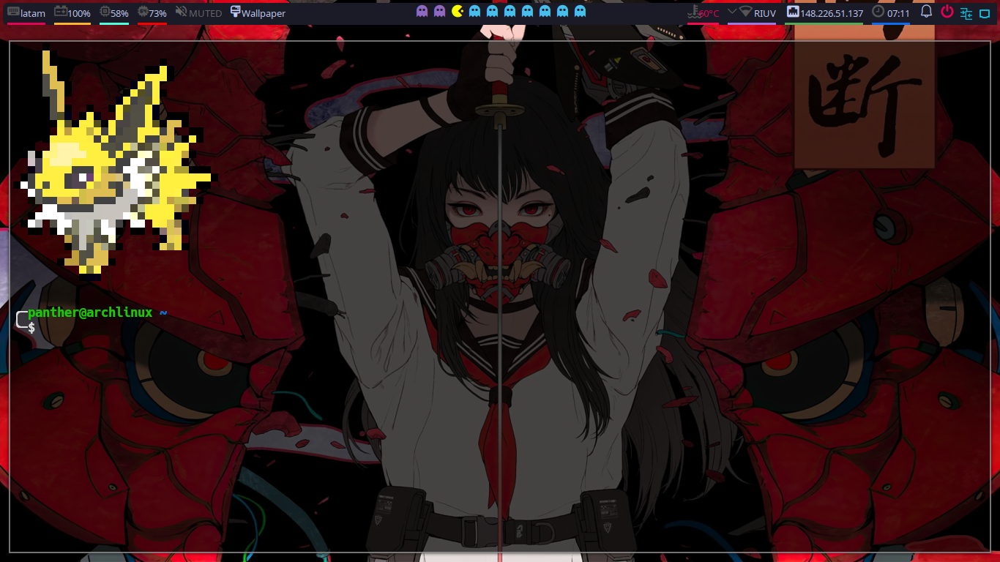
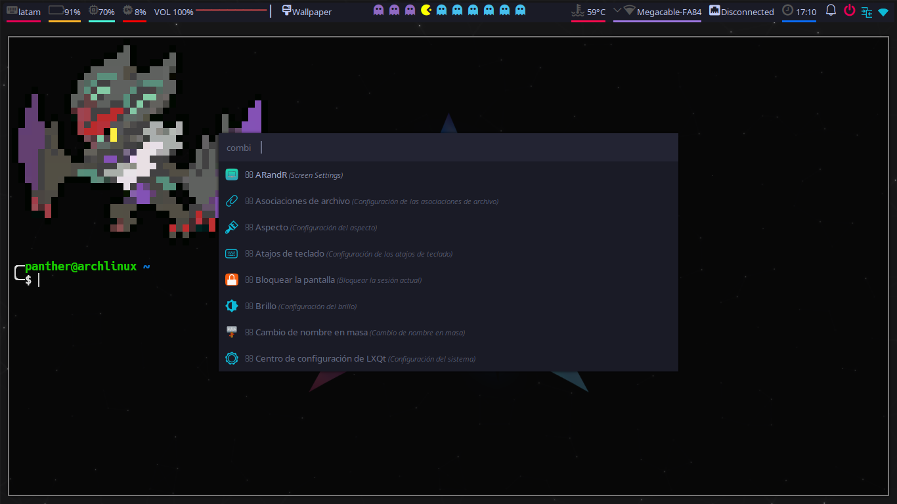

# MyDotFiles

## Color Palette

|Use           |Color  |
|--------------|-------|
|Pac Man       |#fdff00|
|Ghost Occupied|#8f69c2|
|Ghost Urgent  |#bd0d0d|
|Ghost Empty   |#46bfee|

# Info

```mint
            Setup / Bspwm
 -----------------------------------
 ╭─ Distro               -> Arch
 ├─ Editor               -> VSCode / NeoVim
 ├─ Browser              -> Google Chrome
 ├─ Shell                -> ZSH
 ├─ Shell Theme          -> Oh My ZSH
 ╰─ Resource Monitor     -> Htop

 ╭─ Model                -> HP Pavilion g4 Notebook PC
 ├─ CPU                  -> Intel i3-2310M (4) @ 2.100GHz
 ├─ GPU                  -> Intel 2nd Generation Core Processor Family
 ╰─ Resolution           -> 1366x768

 ╭─ WM                   -> Bspwm
 ├─ Top bar              -> Polybar
 ├─ Terminal             -> Kitty
 ├─ Cursors              -> Simp1e Tokyo Night Storm
 ├─ Theme                -> Tokyonight Storm B
 ├─ Icons                -> Tokyonight Dark
 ├─ Font                 -> Hack Nerd Font
 ├─ Compositor           -> Picom
 ├─ Program Launcher     -> Rofi
 ╰─ Notification Daemon  -> Dunst
 
```

# Features
- **Change themes on the fly**: 
- **Theme Selector**: Alt + Space bar to launch it.
- **Random/Static/Animated wallpaper**:
    - **Random**: Every time you switch between rices or restart bspwm a new wallpaper is set depending on the rice you are on.
    - **Static**: You can chose between diferent wallpapers depending on the rice you are on.
    - **Animated**: Not suported yet.
- **Wallpaper Changer**: Super + q changes bethween different wallpapers in the actual rice or you can chose your favorite.

# Preview


